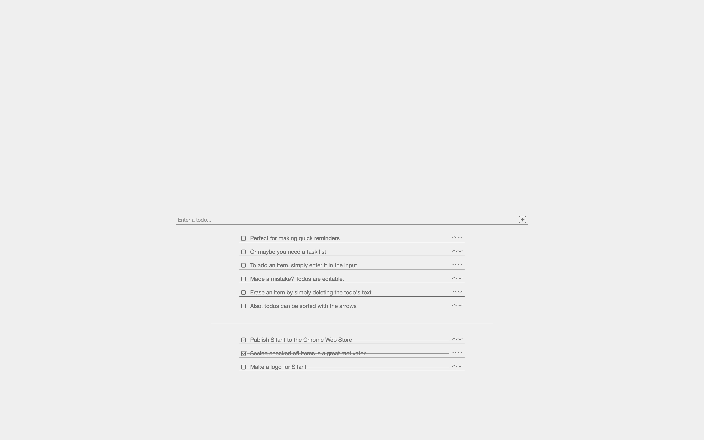

# Sitant 



Sitant is a minimal, yet incredibly functional new tab replacement. It provides a quick place to jot down notes, todos, or tasks without a bunch of additional fluff.

## Installation
Get it from the Web Store [here](https://chrome.google.com/webstore/detail/sitant-simple-tasks-in-ne/koggochfeennbhkkjmbpbhfhociingae).

## Development
This will get you up and running for development on your local machine.

### Prerequisites 
  - [Node.js](https://nodejs.org/en/)
  - [Yarn](https://yarnpkg.com/)
  
### Installing
```bash
# Clone it
git clone https://github.com/JosNun/sitant.git

# Install dependancies
yarn install
```

### Development
Run the dev script

```sh
yarn start
```

Sitant will run on `localhost:3000`

**Note:** When running the dev version, todos will not persist across page loads.

## Building
Make a Web Store ready version

```
yarn build:extension
```

For info on how to add your freshly built version to Chrome, see the [extension dev docs](https://developer.chrome.com/extensions/getstarted#manifest).

## Built With
- [React](https://reactjs.org/)
- [Styled Components](https://www.styled-components.com/)
- [Popmotion Pose](https://popmotion.io/pose/)

## License
This project is icensed under the MIT License - see the [License](./License) file for more details.

